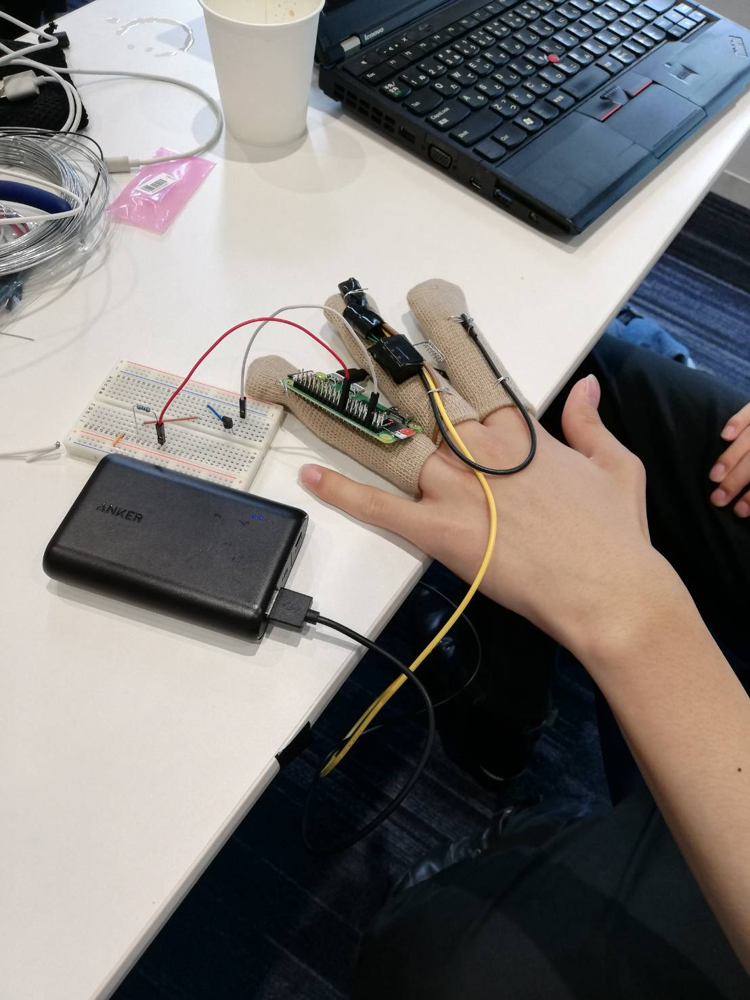
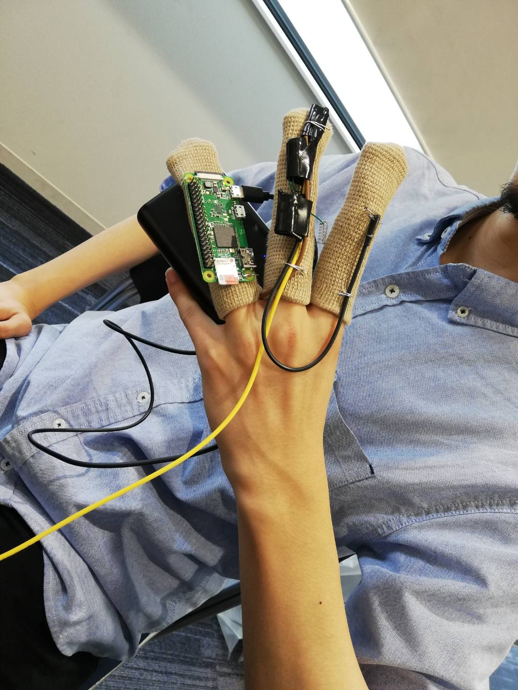
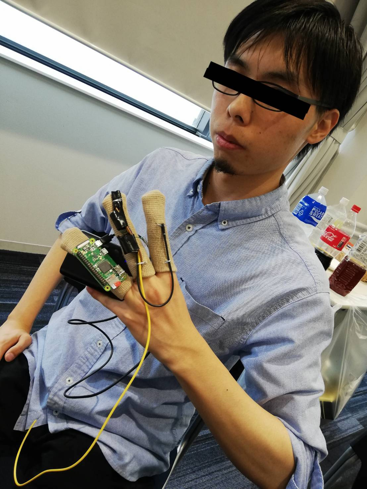

# Xen for backend
これはXenのバックエンドプロジェクトです.  
XenからのHTTPリクエストの受け口とビリビリマシンを動作させる役割を果たしています.

### 動作環境

|||
|:--|:--|
|マシン|Raspberry Pi Zero WH|
|OS|Raspbian Stretch Lite(April 2019)|
|Webサーバ|nginx|
|PHP|PHP 7.0|
|Python|Python 3.5.3|

### 警策グローブ

(撮影: かずきち, モデル: 柿元)
